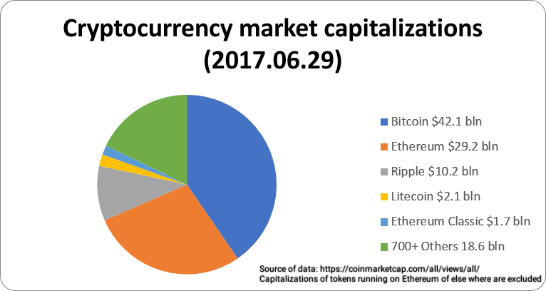

**Link to visualization: https://ananthajanakiraman.github.io**

**This visualization was created using D3.js**

# About the Visualization

A cryptocurrency (or crypto currency) is a digital asset designed to work as a medium of exchange using cryptography to secure the transactions and to control the creation of additional units of the currency. Cryptocurrencies are classified as a subset of digital currencies and are also classified as a subset of alternative currencies and virtual currencies.

Bitcoin became the first decentralized cryptocurrency in 2009. Since then, numerous cryptocurrencies have been created. These are frequently called altcoins, as a blend of bitcoin alternative. Bitcoin and its derivatives use decentralized control as opposed to centralized electronic money/centralized banking systems. The decentralized control is related to the use of bitcoin&#39;s blockchain transaction database in the role of a distributed ledger.

Below is the current market capitalization of different cryptocurrencies and this visualization is a preliminary study of the three most popular cryptocurrencies (Bitcoin, Ethereum and Litecoin) traded worldwide.

# Narrative Visualization

The visualiziation narrates the trends over different time periods (5 Years, 3 Years, 1 Year, 6 Months and 1 Month) for the three most popular crytocurrencies currently traded worldwide. The main visualization includes slides laid out as tabs to visualize the trend for the three most popular cryptocurrencies and each of the slide includes five different parameter setting corresponding to five different time periods used for narration. The parameter setting enables drill down into specific scene or trend visualization for that specific time period and cryptocurrency. Annotation with transition has been included to highlight the peak point or peak value and the lowest point or lowest value for the specific scene or time period for each cryptocurrency type. Each scene in the slide has a tool tip to show details on demand that slides over the entire chart area and is enabled during a mouse over or mouse move event, the tool tip design includes a dashed array ruler that runs across the axes and a stroked circle matching the chart color and representing the data point. The chart type used in the visualization is a line chart with color filled area and different color scales have been employed for the currency types to enable visual differentiation. Colors, tool tips, annotations, parameters etc are kept consistent across the scenes in each slide or tab. The X-Axis represents date variable and Y-Axis represents closing price, the axes are transformed and scaled for each scene according to the data being visualized to fit in the SVG canvas area.

The data used for this visualization has been gathered from different financial portals including investing.com, cryptocompare.com, coinbase.com and coindesk.com. The date range used for this visualziation is between June 2012 to July 2017. The visualization is coded using D3 JS library and I am continuing to enhance them to make the transitions between scenes visually more effective and nice.

Description: Narrative Visualization - Data Visualization Project
